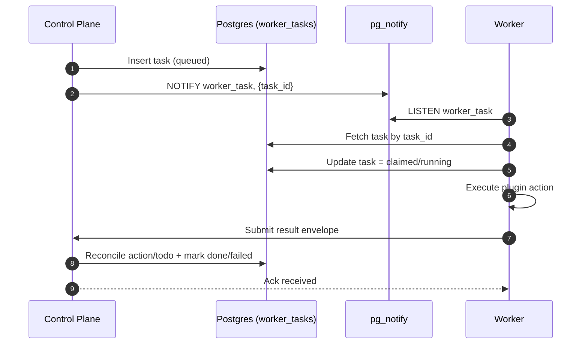

# ADR 0001: Phase 1 Contracts and Boundaries

- **Status:** Accepted
- **Date:** 2026-02-05
- **Owners:** Wingman backend maintainers
- **Related:** `docs/v2-roadmap.md` (Phase 1 anchor), `docs/phase1-anchor-ticket-backlog.md` (`PH1-ADR-001`)

## Context

Phase 1 introduces three architectural shifts that must be contract-first to avoid rework:

1. Action execution moves from direct branching in `PlanExecutor` to plugin-based routing.
2. Approved tasks move from in-process execution to worker delegation via queue.
3. Workers must remain operational during control-plane outages via offline buffering.

Current execution is tightly coupled to action-template branching in `PlanExecutor`, which is functional but not extensible for worker delegation and execution plugins.

## Decision

We standardize the following Phase 1 contracts.

---

## 1) Execution Plugin Contract

### Interface (v1)

```python
class ExecutionPlugin(ABC):
    @property
    @abstractmethod
    def plugin_id(self) -> str: ...

    @property
    @abstractmethod
    def supported_actions(self) -> list[str]: ...

    @abstractmethod
    async def validate_pre(self, action: dict) -> tuple[bool, str]: ...

    @abstractmethod
    async def execute(self, action: dict) -> dict[str, Any]: ...

    @abstractmethod
    async def validate_post(self, action: dict, result: dict) -> tuple[bool, str]: ...

    @abstractmethod
    async def rollback(self, action: dict, result: dict) -> bool: ...
```

### Result shape

Every plugin execution result **must** include:

```json
{
  "success": true,
  "plugin_id": "docker",
  "action": "restart",
  "target": "docker://nginx",
  "started_at": "2026-02-05T12:00:00Z",
  "completed_at": "2026-02-05T12:00:04Z",
  "data": {},
  "error": null,
  "error_code": null
}
```

### Error taxonomy

- `VALIDATION_ERROR` — bad input / blocked target.
- `EXECUTION_ERROR` — runtime failure in plugin or adapter.
- `POSTCHECK_ERROR` — post-validation failed.
- `ROLLBACK_ERROR` — rollback attempt failed.

---

## 2) Worker Message Envelope Contract

### 2.1 Control plane -> worker task envelope

```json
{
  "task_id": "exec-123",
  "task_type": "execute_script",
  "idempotency_key": "exec-123:1",
  "worker_id": "site-a-docker",
  "site_name": "Site A",
  "created_at": "2026-02-05T12:00:00Z",
  "timeout_seconds": 60,
  "payload": {
    "script_id": "restart-container",
    "params": { "container": "nginx" }
  }
}
```

### 2.2 Worker -> control plane result envelope

```json
{
  "worker_id": "site-a-docker",
  "site_name": "Site A",
  "timestamp": "2026-02-05T12:00:05Z",
  "payload_type": "execution_result",
  "task_id": "exec-123",
  "idempotency_key": "exec-123:1",
  "payload": {
    "success": true,
    "details": {}
  }
}
```

`payload_type` values in v1:
- `facts`
- `logs`
- `execution_result`
- `health`

---

## 3) Queue Semantics (PostgreSQL + pg_notify)

### Delivery model

- Queue is **at-least-once** delivery.
- `NOTIFY` payload only contains `task_id` (small payload principle).
- Consumer must read full task body from `worker_tasks` table.

### Idempotency

- Each task has `idempotency_key`.
- Worker stores/reports last-seen idempotency keys for dedupe window.
- Control plane result reconciliation is idempotent by (`task_id`, `idempotency_key`).

### Lifecycle states

`queued -> claimed -> running -> done | failed | dead_letter`

### Retries

- Exponential backoff with max attempts (default 3).
- On max attempts exceeded -> `dead_letter` and emit alert event.

---

## 4) Offline Buffering Contract

### Directory and file naming

- Default directory: `/data/offline`
- File pattern: `<payload_type>-<ISO8601UTC>-<task_or_seq>.json`
- Examples:
  - `facts-2026-02-05T12-00-00Z-00001.json`
  - `execution_result-2026-02-05T12-00-10Z-exec-123.json`

### Storage policy

- Max buffer size: 100 MB (configurable).
- Max age: 24 hours (configurable).
- Eviction policy: oldest-first.

### Replay policy

1. List pending files sorted by timestamp DESC (newest first).
2. Submit one by one with rate-limit.
3. Delete only after explicit ack from control plane.
4. If ack fails, keep file for retry.

---

## 5) Migration from current PlanExecutor path

### Current path

`ControlPlane -> PlanExecutor (branch by ActionTemplate) -> Adapter`

### Phase 1 migration

1. Add plugin interface + registry with Docker/Script plugins.
2. Refactor `PlanExecutor` to resolve plugin/action mapping.
3. Preserve legacy local execution fallback behind feature flag.
4. Add worker queue delegation for worker-eligible actions.

### Feature flags

- `EXECUTION_PLUGIN_ENABLED` (default `true` in dev once stable)
- `WORKER_DELEGATION_ENABLED` (default `false` until queue/worker tests pass)

---

## Sequence Diagram (approval -> queue -> worker -> result)



## Consequences

### Positive

- Clear contract boundaries enable parallel implementation across tickets.
- Plugin boundary supports future marketplace/execution ecosystem.
- Worker/offline semantics become testable and deterministic.

### Tradeoffs

- At-least-once requires idempotency and duplicate-safe reconciler logic.
- Additional queue/worker state increases operational complexity.

## Validation Criteria

This ADR is considered implemented when:

1. Plugin execution for restart/start/stop runs through registry.
2. Worker receives queued tasks from pg_notify and returns typed envelopes.
3. Offline replay follows newest-first + ack-delete semantics.
